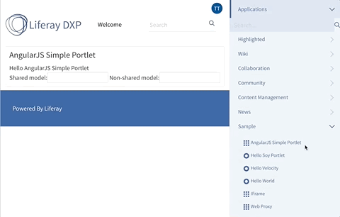

# AngularJS Portlet [](id=angularjs-portlet)

## What does this sample do when it's deployed? [](id=what-does-this-sample-do-when-its-deployed)

This example demonstrates how to integrate AngularJS (v1.x) with Liferay, providing it as an instantiable portlet.



## What API(s) and/or code components does this sample highlight? [](id=what-apis-and-or-code-components-does-this-sample-highlight)

This sample leverages the customization by
[overring core JSPs](https://dev.liferay.com/develop/tutorials/-/knowledge_base/7-0/overriding-core-jsps).

## How does this sample leverage the API(s) and/or code component? [](id=how-does-this-sample-leverage-the-apis-and-or-code-component)

This sample is based on two projects:

- [angularjs-hook](angularjs-hook): Loads AngularJS globally by overring core JSPs. To achieve that, the file [top_js-ext.jspf](angularjs-hook/src/main/resources/META-INF/jsps/html/common/themes/top_js-ext.jspf) ensures the right place to add the AngularJS framework.
- [angularjs-simple-portlet](angularjs-simple-portlet): An example to demonstrate how to use AngularJS in a portlet, and making it instantiable.

The [angularjs-hook](angularjs-hook) project provides a function to bootstrap an AngularJS portlet. The following piece of code contains the bootstrap phase. Each portlet will be instantiable because it will be loaded using its portletId as an unique [AngularJS module name](https://docs.angularjs.org/api/ng/function/angular.module).

```javascript
...
angular.portlet.add = function(portletName, angularFunction) {
  angularPortlets[portletName] = angularFunction;
};

  Liferay.Portlet.ready(function(portletInstanceId, node) {

  var idx = portletInstanceId.indexOf('_INSTANCE_'); 
  var portletName = portletInstanceId.substring(0, idx);

  if (angularPortlets[portletName]) {

    var portletId = portletInstanceId.substring(idx).replace('_INSTANCE_', '');

    angular.bootstrap(node.getDOMNode(), angularPortlets[portletName](
		  portletId, node.getDOMNode()));
    }
  });
})(Liferay, angular);
```

A [SharedService](angularjs-hook/src/main/resources/META-INF/resources/js/main.js#L29) module is also provided on it that allows shared models between AngularJS portlets, the following code demonstrates an input shared with any module that reuses the same model.

A model as a shared object:

```javascript
$scope.sharedModel = function(value) {
			if (angular.isDefined(value)) {
			  SharedService.change('sharedModel', value)
			} else {
			  return SharedService.get().sharedModel
      }
``` 

The shared object in an input field:     

```html
<span>Shared model:</span>
<input ng-model="sharedModel" ng-model-options=" {getterSetter: true } "></input>

```

## Where Is This Sample? [](id=where-is-this-sample)

There are three different versions of this sample, each built with a different
build tool:

- [Gradle](https://github.com/liferay/liferay-blade-samples/tree/master/gradle/apps/angularjs)
- [Liferay Workspace](https://github.com/liferay/liferay-blade-samples/tree/master/liferay-workspace/apps/angularjs)
- [Maven](https://github.com/liferay/liferay-blade-samples/tree/master/maven/apps/angularjs)